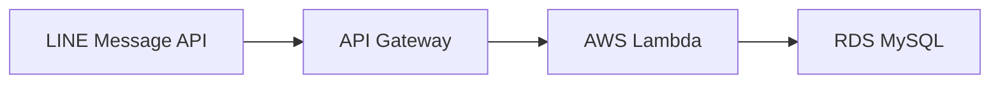
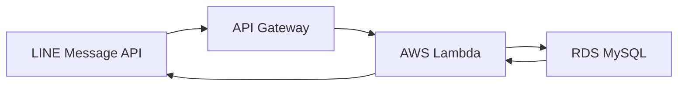
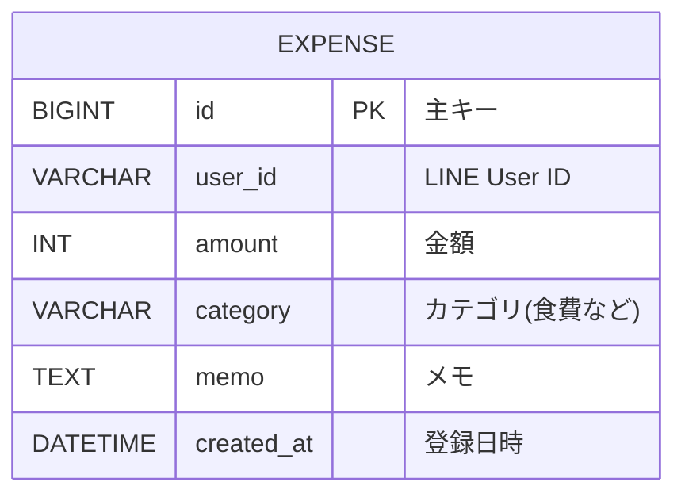

## アーキテクチャ図
ユーザーの支出を保存

グラフを出力

## 使用方法
ユーザーがLINEで[1200 食費 メモ]のように送ると
DBに1200,食費が保存される

ユーザーが[グラフ]と送るとDBの情報を集計し、テキストで日ごとの使用金額がラインで送られてくる

## DBの設計

ユーザごとにデータを分離している

## Lambdaの機能
DailyTotal.java:[日付、その日の支出の合計金額]を1セットにまとめるデータ型を定義

DbAccess.java:SQLにアクセスし、支出情報をINSERTする

DbConfig.java:データベース接続に必要な情報を1つにまとめて管理する

GetStatus.java:SQLから日別の支出合計を取得する

Handler.java:LINEのメッセージをJSONから取り出し、メインの処理を行う。

JdbcUtil.java:JavaオブジェクトからJDBC用のURLを作る

SecretsUtil.java:AWS Secrets Managerから秘密情報(DBのパスワードなど)を取り出してくる

FormatStatus.java:フォーマットの情報を保持

FormatCheck.java:フォーマットがあっているか確認
## Lambdaのメイン処理
1.API GatewayからのWebhook JSONを受け取る

2.Messageからtextを取り出す

3.入力形式を判定

  [数字、カテゴリ、メモ]ならSQLにINSERT

  [グラフ]ならSQLからSELECTし、集計したデータをLINEで返す

## セキュリティ
DBパスワードをAWS Secrets Managerに保存

Lambdaには環境変数のみを記述

## 今後の改善案
ユーザーからの入力の型をより自由にする

入力の取り消しを可能にする

月ごとの合計金額や、カテゴリーごとの合計金額を出力する

過去にさかのぼって支出の入力、取り消しを可能にするためにDBに新しいカラムを追加する
